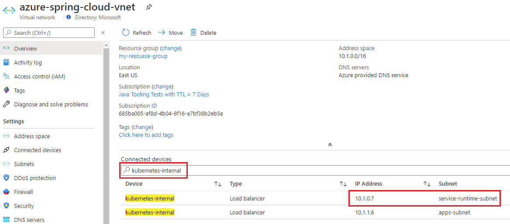
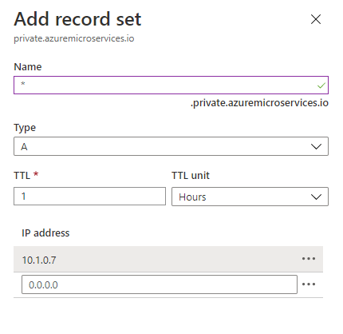
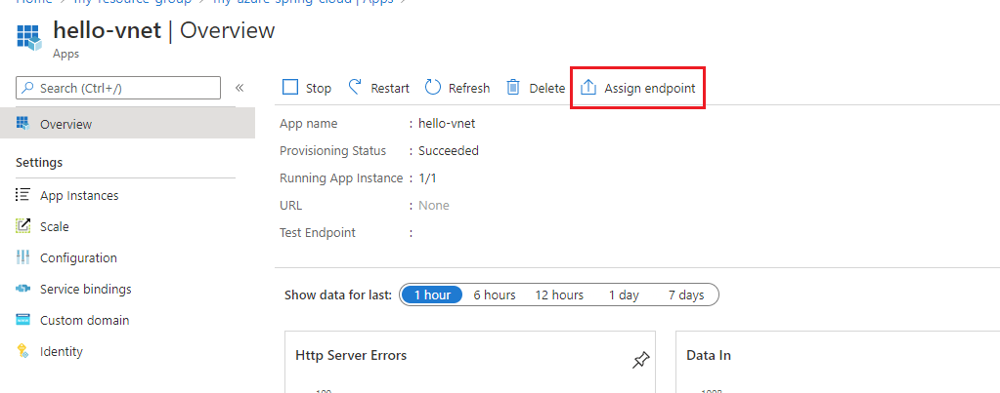
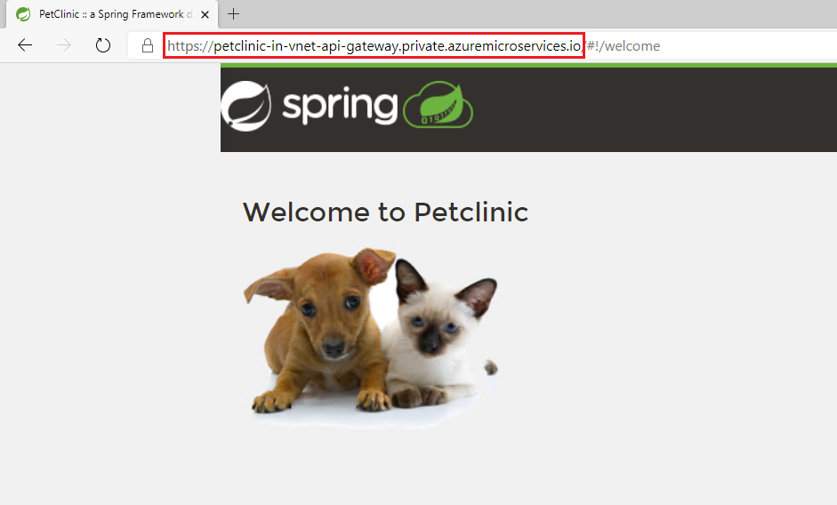

# Access your application in private network

When **Assign Endpoint** for applications in an Azure Spring Cloud service instance deployed in your own virtual network, the endpoint is a private FQDN which is only accessible in private network. To access the application endpoint, you need to create an **Azure Private DNS Zone** in your subscription to translate/resolve the private FQDN to its IP address.

## Create a private DNS zone

1. Open the Azure portal. From the top search box, search for **Private DNS zones**, and select **Private DNS zones** from the result.

2. On the **Private DNS zones** page, select **+ Add**.

3. Fill out the form on the **Create Private DNS zone** page. Please enter **private.azuremicroservices.io** as the **Name** of the zone.

4. Select **Review + Create**.

5. Select **Create**.

It may take a few minutes to create the zone.

## Link the virtual network

To link the private DNS zone to the virtual network, you need to create a virtual network link.

1. Select the **private.azuremicroservices.io** private DNS zone resource created above.

2. On the left pane, select **Virtual network links**.

3. Select **Add**.

4. Type **azure-spring-cloud-dns-link** for the **Link name**.

5. For **Virtual network**, select the virtual network you created in guidance [Deploy Azure Spring Cloud in your Azure virtual network (VNet injection)](01-deploy-azure-spring-cloud-in-your-vnet.md).

    

6. Select **OK**.

## Create DNS record

To use the private DNS zone to translate/resolve DNS, you need to create an "A" type record in the zone.

1. Select the virtual network resource you created in guidance [Deploy Azure Spring Cloud in your Azure virtual network (VNet injection)](01-deploy-azure-spring-cloud-in-your-vnet.md).

2. In the **Connected devices** search box, enter *kubernetes-internal*.

3. In the filtered result, find the one connected to the *Service Runtime subnet* of the service instance, and copy its **IP Address**. In this sample, the IP Address is *10.1.0.7*.

    

4. Select the **private.azuremicroservices.io** private DNS zone resource created above.

5. Select **+ Record set**.

6. In **Add record set**, enter or select this information:

    |Setting     |Value                                                                      |
    |------------|---------------------------------------------------------------------------|
    |Name        |Enter *\**                                                                 |
    |Type        |Select **A**                                                               |
    |TTL         |Enter *1*                                                                  |
    |TTL unit    |Select **Hours**                                                           |
    |IP address  |Enter the IP address copied in step 3. In the sample, enter *10.1.0.7*.    |

    Then select **OK**.

    

## Assign private FQDN for your application

After following the guide of [Build and deploy microservice applications](https://github.com/Azure/azure-spring-cloud-docs-pr/tree/vnet-injection/docs/manage-virtual-network), you can assign private FQDN for your application.

1. Select the Azure Spring Cloud service instance deployed in your own virtual network, and open the **Apps** tab in the menu on the left.

2. Select the application to show the **Overview** page.

3. Select **Assign Endpoint** to assign a private FQDN to your application. This can take a few minutes.

    

4. The assigned private FQDN (labeled **URL**) is now available. It can only be accessed within the private network, but not on Internet.

## Access application private FQDN

After assign, now you can access the private FQDN of your application in private network. For example, you can create a jumpbox machine in the same virtual network, or a peered virtual network, and on that jumpbox machine the private FQDN is accessible.

## Next

- [Expose applications to Internet - using Application Gateway and Azure Firewall](04-make-your-application-accessible-on-internet-appgw.md)