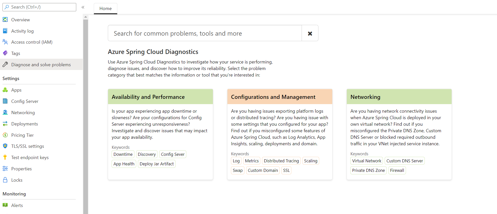
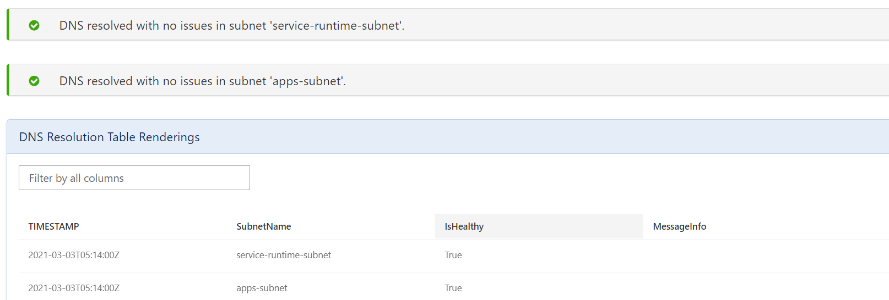
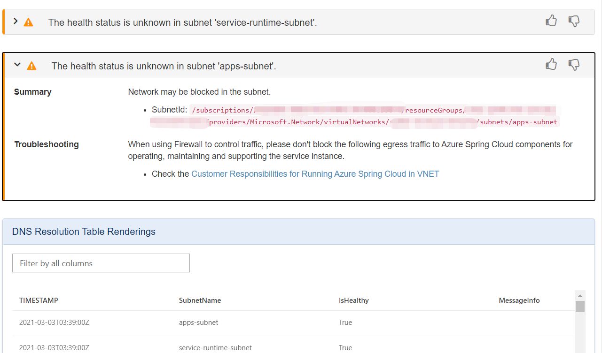
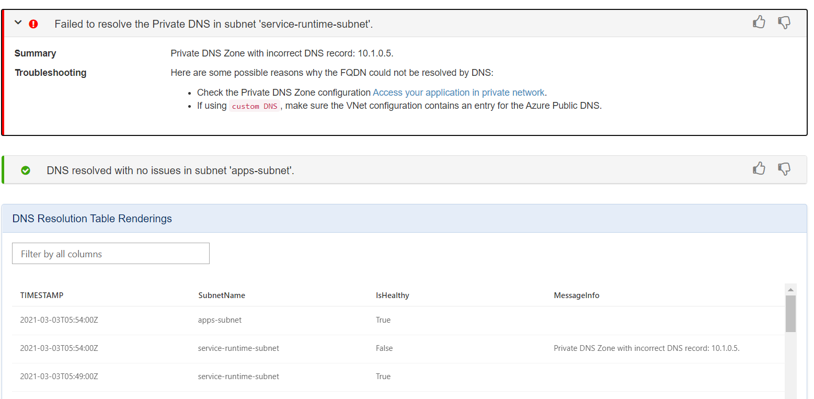
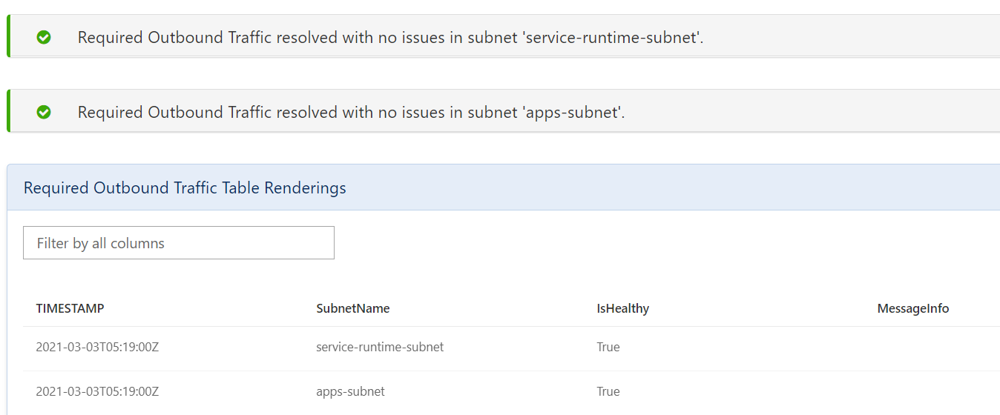
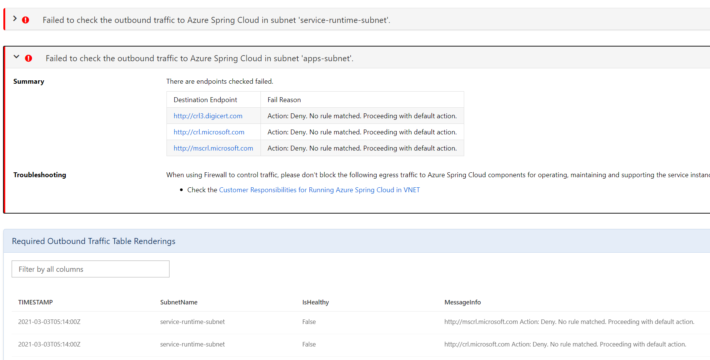
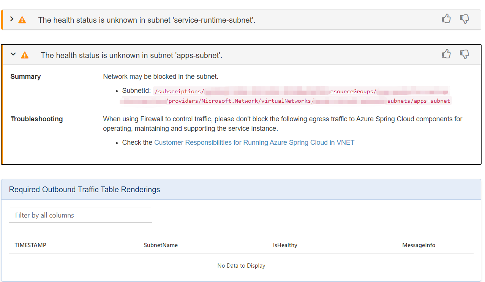

# Self-diagnose for Running Azure Spring Cloud in VNET

## Navigate to the diagnostics page
1. Sign in to the Azure portal.
1. Go to your Azure Spring Cloud Overview page.
1. Open Diagnose and solve problems in the menu on the left side of the page.
1. Select the third category named **Networking**.

    

## View a diagnostic report
After you click the **Networking** category, you can view two issues related to Networking specific to your VNet injected Azure Spring Cloud: **DNS Resolution** and **Required Outbound Traffic**.

Find your target issue, and click it to view the diagnostic report. A summary of diagnostics will be shown after your click. Some results contain related documentation.

If your Azure Spring Cloud resource has been deleted, you will see the results like **Resource has been removed.**
    

If your Azure Spring Cloud resource is not deployed in your own virtual network, you will see the following prompt.
    

Different subnets will display the results separately.
### DNS Resolution 
Healthy results:
    

Assuming the context end time is **2021-03-03T04:20:00Z**, and the diagnostic report like the following picture. The latest TIMESTAMP in the **DNS Resolution Table Renderings** is yesterday, more than **30 minutes** from the context end time, the health status will be unknown. Since the health check log may not be sent out because of the blocked network. 

The unknown health status results contain related documentation, you can click the left angle brackets.
    

Assuming the context end time is 2021-03-03T06:00:00Z and you misconfigured your Private DNS Zone record set, you will get a Critical result like `Failed to resolve the Private DNS in subnet xxx`. 

In the **DNS Resolution Table Renderings** you will find the detail message info, you can check your config with that.
    

### Required Outbound Traffic 
Healthy results:
    

If any of your subnet is blocked by NSG or firewall rules, you will find the following failures unless you blocked the log. Then you can check whether you miss any [Customer Responsibilities](https://github.com/microsoft/vnet-in-azure-spring-cloud/blob/master/06-customer-responsibilities-for-running-azure-spring-cloud-in-vnet.md).
    

If there are no data in `Required Outbound Traffic Table Renderings` within 30 minutes, it will result in unknown health status. 
Maybe your network is blocked or the Log service is down.
    